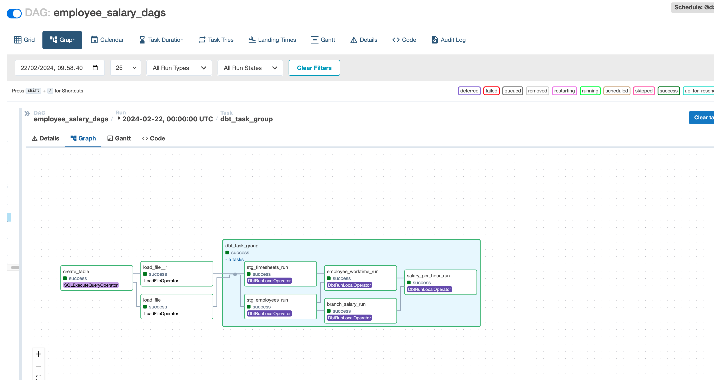

# Challenge Test - Employee Hourly Salary

## Prerequisites
This section lists the prerequisites needed to perform the challenge test successfully. It includes:
- [Python 3.10](https://www.python.org/)
- [Docker Desktop](https://www.docker.com/products/docker-desktop/)
- [Astro CLI](https://docs.astronomer.io/astro/cli/overview)
- [DBeaver](https://dbeaver.io/)(Optional) 

## How to:
This section provides instructions on how to build and execute the project, as well as how to remove all resources afterward.
### Build the project
This command initiates the building process for the project using the Astro CLI:
```bash
astro dev start
```
It's likely that this command will handle setting up the development environment, including any necessary dependencies and configurations.

Upon successful execution, the Airflow Web UI can be accessed locally via the provided link:
- [Airflow Web UI](http://localhost:8080)


### Remove all resources
This command is used to remove or clean up all resources created during the execution of the project:
```bash
astro dev kill
```
Executing this command is typically done after completing the task or when the resources are no longer needed. It ensures that any containers, services, or other resources created during the development process are properly terminated and cleaned up.

You can use this <b>credentials</b> to access data from query tool like pgadmin, dbeaver, etc:
```bash
Credentials:
    hostname: localhost
    schema: postgres
    username: postgres
    password: postgres
    port: 5432
```
Ensure <b>Docker</b> is up and no other <b>postgres</b> server running through this port.


